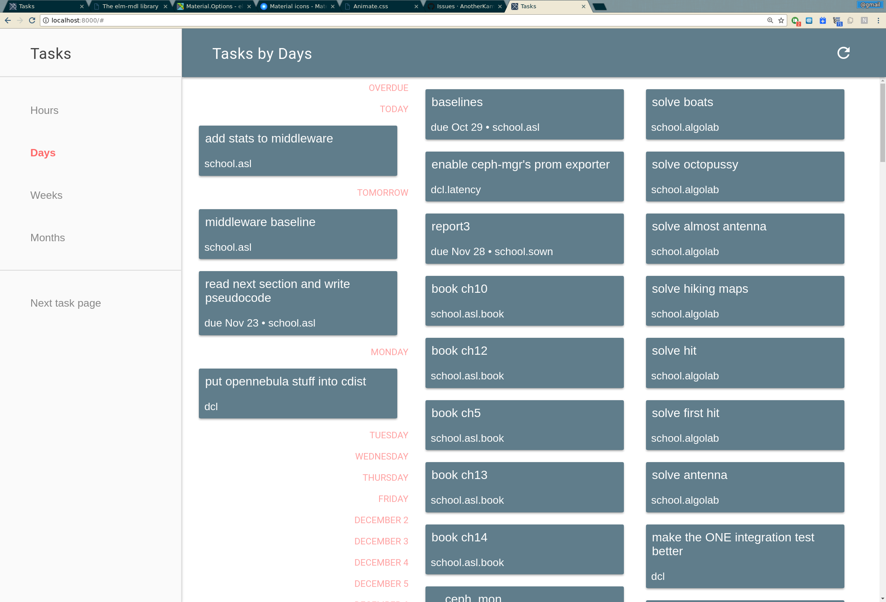
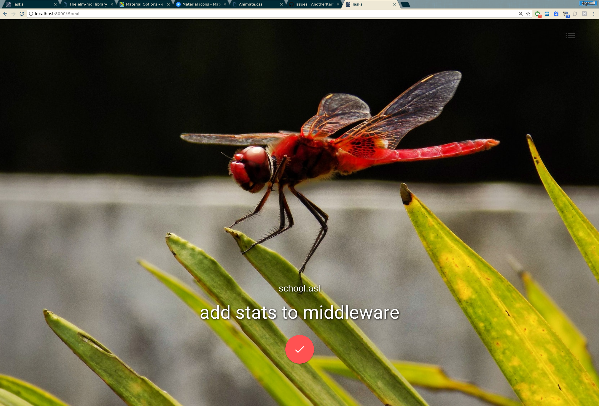

# tasksched

An opinionated Taskwarrior web UI. Great for scheduling when to do your tasks.

A pretty "next task" page is included:

It displays your next scheduled task, or the most urgent task if none are scheduled.

# Overview

This is meant to run "locally", i.e. it does not attempt to deal with authentication, taskserver, or anything. The server must be able to call the `task` CLI with your setup. Therefore, run it as your user, either locally, or on a server where you have set up task synchronization (behind HTTP auth or something).

It does not communicate with taskserver as AFAIK there is no standardized HTTP API (let me know if I am wrong). Instead, the included small server translates HTTP calls to calls to the `task` CLI.

# How to use

`make run` will install dependencies, build the app and run the server. Make sure that the `task` CLI is set up.

## How to get the best Chrome new tab page ever

point this extension:
https://chrome.google.com/webstore/detail/new-tab-url/njigpponciklokfkoddampoienefegcl/related
to your "Next task page" URL (#next)

# Thanks to

- built with [Elm](http://elm-lang.org/)
- background images for the awesome next task page come from [the pretty API by Unsplash](https://source.unsplash.com/)
- obviously, [Taskwarrior](https://taskwarrior.org) is awesome
